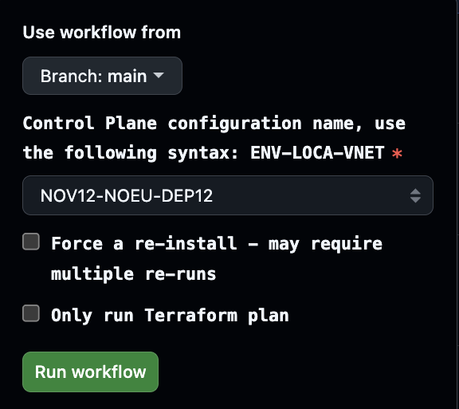

# Use SAP Deployment Automation Framework from GitHub

GitHub streamlines the deployment process by providing workflows that you can run to perform the infrastructure deployment and the configuration and SAP installation activities.

You can use GitHub Repos to store your configuration files and use GitHub Actions to deploy and configure the infrastructure and the SAP application.

## Sign up for GitHub

To use SAP Deployment Automation Framework from GitHub, you need to have a GitHub account and the right permissions to create a repository.

## Create a new GitHub repository

Use the `https://github.com/Azure/sap-automation-gh-bootstrap` repository template as a starting point for your own repository. Click the [**Use this template**](https://github.com/new?template_name=sap-automation-gh-bootstrap&template_owner=Azure) button to create a new repository based on the template.

> [!NOTE]
> The GitHub Actions is using Environments to store secrets and variables. Make sure your repository can use the [environments feature](https://docs.github.com/en/actions/deployment/targeting-different-environments/using-environments-for-deployment) and the Issues feature is enabled.

You can use the Python script to help you automating the setup of a GitHub App, repository secrets, environment, and connection to Azure for deploying SAP Deployment Automation Framework on Azure

# Deploy the Control Plane

The deployment uses the configuration defined in the Terraform variable files located in the `/WORKSPACES/DEPLOYER` and `/WORKSPACES/LIBRARY` folders.

1. In the GitHub repository, navigate to the `Actions` tab.
2. Select the `01 - Deploy Control Plane` workflow.
3. Click the `Run workflow` button and select the configuration name for the deployer and the SAP library.

You can track the progress in the `Actions` tab. After the deployment is finished, you can see the control plane details on the summary output.

# GitHub runner troubleshooting

The GitHub runner is a self-hosted runner that runs the GitHub Actions. If you encounter issues with the runner, you can troubleshoot the runner by following these steps.

- Validate the runner is registered in your repository and is **Online** or **Active** in the `Settings` - `Actions` - `Runners` in the GitHub repository.
- Validate the runner is installed on the VM by validating the output of the VM extension Custom Script named `configure_deployer` in the Azure Portal.

## Retry installation of the GitHub runner

The GitHub runner is installed on the Deployer VM in the first step of the deployment. If the runner installation fails, you can retry the installation by following these steps.

- Remove the Custom Script extension `configure_deployer` in the Azure Portal.
- Remove the runner from the GitHub repository.
- Run the `Deploy Control Plane` workflow again, with the `Force a re-install` setting enabled.
